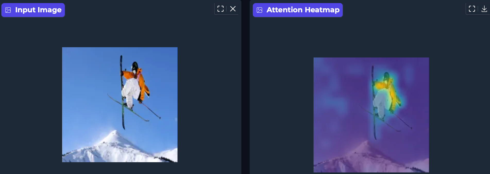

# ViT Attention Explorer

An interactive tool to visualize and explore Vision Transformer attention patterns. Upload an image and click around to see what different layers and heads are focusing on.



## Features

- **Global Rollout**: See the aggregated attention flow across all layers
- **Layer & Head Selection**: Zoom in on individual layers and attention heads
- **Interactive Exploration**: Click on any patch in the image to see which other patches attend to it
- **CLS Token Visualization**: Understand what the model's classification token focuses on
- **Adjustable Opacity**: Blend the heatmap with the original image

## Getting Started

### Requirements

- Python 3.8+
- PyTorch
- Gradio
- Transformers
- Pillow

### Installation

```bash
pip install torch torchvision gradio transformers pillow numpy
```

### Running the App

```bash
python app.py
```

The app will launch at `http://127.0.0.1:7860/` in your browser.

## How to Use

1. **Upload an Image**: Use the upload box to select an image
2. **Choose Visualization Type**: Select "Rollout" for global attention or a specific layer
3. **Pick an Attention Head**: If not using Rollout, select which head to visualize (or "Average")
4. **Explore**:
   - Click "Visualize CLS Token" to see what the model's classification token attends to
   - Click on any patch in the image to see what attends *to* that patch
5. **Adjust Opacity**: Use the slider to blend the heatmap more or less with the original image

## Understanding Attention Rollout

The **Rollout** visualization aggregates attention across all 12 layers to show global attention flow. For each layer, we average attention across all heads, add residual connections to account for skip connections, and multiply with the accumulated flow from previous layers. We also prune the bottom 90% of attention values to reduce noise and highlight dominant patterns. The result is a global map showing which input patches most influence the model's final classification.

## Architecture

- `app.py` - Gradio interface and event handlers
- `vit_analyzer.py` - ViT model loading and attention computation (includes attention rollout)
- `visualization.py` - Heatmap generation and blending
- `config.py` - Configuration (model name, image size, etc.)
